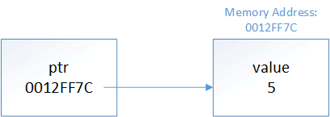

# 6.7 - Introduction to pointers

In lesson 1.3 -- a first look at variables, we noted that a variable is a name for a piece of memory that holds a value. When our program instantiates a variable, a free memory address is automatically assigned to the variable, and any value we assign to the variable is stored in this memory address.

For example:

```
int x;
```

When this statement is executed by the CPU, a piece of memory from RAM will be set aside. For the sake of example, let’s say that the variable x is assigned memory location 140. Whenever the program sees the variable x in an expression or statement, it knows that it should look in memory location 140 to get the value.

The nice thing about variables is that we don’t need to worry about what specific memory address is assigned. We just refer to the variable by its given identifier, and the compiler translates this name into the appropriately assigned memory address.

However, this approach has some limitations, which we’ll discuss in this and future lessons.

## The address-of operator (&)

The address-of operator (&) allows us to see what memory address is assigned to a variable. This is pretty straightforward:

```
#include <iostream>

int main()
{
    int x = 5;
    std::cout << x << '\n'; // print the value of variable x
    std::cout << &x << '\n'; // print the memory address of variable x

    return 0;
}
```

On the author’s machine, the above program printed:

```
5
0027FEA0
```

**Note**: Although the address-of operator looks just like the bitwise-and operator, you can distinguish them because the address-of operator is unary, whereas the bitwise-and operator is binary.

## The dereference operator (\*)

Getting the address of a variable isn’t very useful by itself.

The dereference operator (*) allows us to get the value at a particular address:

```
#include <iostream>

int main()
{
    int x = 5;
    std::cout << x << '\n'; // print the value of variable x
    std::cout << &x << '\n'; // print the memory address of variable x
    std::cout << *&x << '\n'; /// print the value at the memory address of variable x

    return 0;
}
```

On the author’s machine, the above program printed:

```
5
0027FEA0
5
```

Note: Although the dereference operator looks just like the multiplication operator, you can distinguish them because the dereference operator is unary, whereas the multiplication operator is binary.


## **Pointers**

With the address-of operator and dereference operators now added to our toolkits, we can now talk about pointers. A pointer is a variable that holds a memory address as its value.

Pointers are typically seen as one of the most confusing parts of the C++ language, but they’re surprisingly simple when explained properly.

## Declaring a pointer

Pointer variables are declared just like normal variable, only with an asterisk between the data type and the variable name:

```
int *iPtr; // a pointer to an integer value
double *dPtr; // a pointer to a double value

int* iPtr2; // also valid syntax (acceptable, but not favored)
int * iPtr3; // also valid syntax (but don't do this)

int *iPtr4, *iPtr5; // declare two pointers to integer variables
```

Note that the asterisk here is not a dereference. It is part of the pointer declaration syntax.

Syntactically, C++ will accept the asterisk next to the data type, next to the variable name, or even in the middle.

However, when declaring multiple pointer variables, the asterisk has to be included with each variable. It’s easy to forget to do this if you get used to attaching the asterisk to the type instead of the variable name!

```
int* iPtr6, iPtr7; // iPtr6 is a pointer to an int, but iPtr7 is just a plain int!
```

For this reason, when declaring a variable, we recommend putting the asterisk next to the variable name.

Best practice: When declaring a pointer variable, put the asterisk next to the variable name.

However, when returning a pointer from a function, it’s clearer to put the asterisk next to the return type:

```
int* doSomething();
```

This makes it clear that the function is returning a value of type int* and not an int.

Best practice: When declaring a function, put the asterisk of a pointer return value next to the type.

Just like normal variables, pointers are not initialized when declared. If not initialized with a value, they will contain garbage.

## Assigning a value to a pointer

Since pointers only hold addresses, when we assign a value to a pointer, that value has to be an address. One of the most common things to do with pointers is have them hold the address of a different variable.

To get the address of a variable, we use the address-of operator:

```
int value = 5;
int *ptr = &value; // initialize ptr with address of variable value
```

Conceptually, you can think of the above snippet like this:



This is where pointers get their name from -- ptr is holding the address of variable value, so we say that ptr is “pointing to” value.

It is also easy to see using code:

```
#include <iostream>

int main()
{
    int value = 5;
    int *ptr = &value; // initialize ptr with address of variable value

    std::cout << &value << '\n'; // print the address of variable value
    std::cout << ptr << '\n'; // print the address that ptr is holding

    return 0;
}
```

On the author’s machine, this printed:

```
0012FF7C
0012FF7C
```

The type of the pointer has to match the type of the variable being pointed to:

```
int iValue = 5;
double dValue = 7.0;

int *iPtr = &iValue; // ok
double *dPtr = &dValue; // ok
iPtr = &dValue; // wrong -- int pointer cannot point to the address of a double variable
dPtr = &iValue; // wrong -- double pointer cannot point to the address of an int variable
```

Note that the following is also not legal:

```
int *ptr = 5;
```

This is because pointers can only hold addresses, and the integer literal 5 does not have a memory address. If you try this, the compiler will tell you it cannot convert an integer to an integer pointer.

C++ will also not allow you to directly assign literal memory addresses to a pointer:

```
double *dPtr = 0012FF7C; // not okay, treated as assigning an integer literal
```

## The address-of operator returns a pointer

It’s worth noting that the address-of operator (&) doesn’t return the address of its operand as a literal. Instead, it returns a pointer containing the address of the operand, whose type is derived from the argument (e.g. taking the address of an int will return the address in an int pointer).

We can see this in the following example:

```
#include <iostream>

int main()
{
	int x(4);
	std::cout << typeid(&x).name();

	return 0;
}
```

On Visual Studio 2013, this printed:

```
int *
```

This pointer can then be printed or assigned as desired.


## Dereferencing pointers

Once we have a pointer variable pointing at something, the other common thing to do with it is dereference the pointer to get the value of what it’s pointing at. A dereferenced pointer evaluates to the contents of the address it is pointing to.

```
int value = 5;
std::cout << &value; // prints address of value
std::cout << value; // prints contents of value

int *ptr = &value; // ptr points to value
std::cout << ptr; // prints address held in ptr, which is &value
std::cout << *ptr; // dereference ptr (get the value that ptr is pointing to)
```

The above program prints:

```
0012FF7C
5
0012FF7C
5
```

This is why pointers must have a type. Without a type, a pointer wouldn’t know how to interpret the contents it was pointing to when it was dereferenced. It’s also why the type of the pointer and the variable address it’s being assigned to must match. If they did not, when the pointer was dereferenced, it would misinterpret the bits as a different type.

Once assigned, a pointer value can be reassigned to another value:

```
int value1 = 5;
int value2 = 7;

int *ptr;

ptr = &value1; // ptr points to value1
std::cout << *ptr; // prints 5

ptr = &value2; // ptr now points to value2
std::cout << *ptr; // prints 7
```

When the address of variable value is assigned to ptr, the following are true:

- ptr is the same as &value
- *ptr is treated the same as value

Because *ptr is treated the same as value, you can assign values to it just as if it were variable value! The following program prints 7:

```
int value = 5;
int *ptr = &value; // ptr points to value

*ptr = 7; // *ptr is the same as value, which is assigned 7
std::cout << value; // prints 7
```

## A warning about dereferencing invalid pointers

Pointers in C++ are inherently unsafe, and improper pointer usage is one of the best ways to crash your application.

When a pointer is dereferenced, the application attempts to go to the memory location that is stored in the pointer and retrieve the contents of memory. For security reasons, modern operating systems sandbox applications to prevent them from improperly interacting with other applications, and to protect the stability of the operating system itself. If an application tries to access a memory location not allocated to it by the operating system, the operating system may shut down the application.

The following program illustrates this, and will probably crash when you run it (go ahead, try it, you won’t harm your machine):

```
#include <iostream>

void foo(int *&p)
{
}

int main()
{
    int *p; // Create an uninitialized pointer (that points to garbage)
    foo(p); // Trick compiler into thinking we're going to assign this a valid value

    std::cout << *p; // Dereference the garbage pointer

    return 0;
}
```

## The size of pointers

The size of a pointer is dependent upon the architecture the executable is compiled for -- a 32-bit executable uses 32-bit memory addresses -- consequently, a pointer on a 32-bit machine is 32 bits (4 bytes). With a 64-bit executable, a pointer would be 64 bits (8 bytes). Note that this is true regardless of what is being pointed to:

```
char *chPtr; // chars are 1 byte
int *iPtr; // ints are usually 4 bytes
struct Something
{
    int nX, nY, nZ;
};
Something *somethingPtr; // Something is probably 12 bytes

std::cout << sizeof(chPtr) << '\n'; // prints 4
std::cout << sizeof(iPtr) << '\n'; // prints 4
std::cout << sizeof(somethingPtr) << '\n'; // prints 4
```

As you can see, the size of the pointer is always the same. This is because a pointer is just a memory address, and the number of bits needed to access a memory address on a given machine is always constant.

## What good are pointers ?

At this point, pointers may seem a little silly, academic, or obtuse. Why use a pointer if we can just use the original variable?

It turns out that pointers are useful in many different cases:

1) Arrays are implemented using pointers. Pointers can be used to iterate through an array (as an alternative to array indices) (covered in lesson 6.8).
2) They are the only way you can dynamically allocate memory in C++ (covered in lesson 6.9). This is by far the most common use case for pointers.
3) They can be used to pass a large amount of data to a function in a way that doesn’t involve copying the data, which is inefficient (covered in lesson 7.4)
4) They can be used to pass a function as a parameter to another function (covered in lesson 7.8).
5) They can be used to achieve polymorphism when dealing with inheritance (covered in lesson 12.1).
6) They can be used to have one struct/class point at another struct/class, to form a chain. This is useful in some more advanced data structures, such as linked lists and trees.

Don’t worry if you don’t understand what most of these are yet. Now that you understand what pointers are, we can start taking an in-depth look at the various cases in which they’re useful, which we’ll do in subsequent lessons.


## Conclusion

Pointers are variables that hold a memory address. They can be dereferenced using the dereference operator (*) to retrieve the value at the address they are holding. Dereferencing a garbage pointer may crash your application.

Best practice: When declaring a pointer variable, put the asterisk next to the variable name.
Best practice: When declaring a function, put the asterisk of a pointer return value next to the type.


## Quiz

1) What values does this program print? Assume a short is 2 bytes, and a 32-bit machine.

```
short value = 7; // &value = 0012FF60
short otherValue = 3; // &otherValue = 0012FF54

short *ptr = &value;

std::cout << &value << '\n';
std::cout << value << '\n';
std::cout << ptr << '\n';
std::cout << *ptr << '\n';
std::cout << '\n';

*ptr = 9;

std::cout << &value << '\n';
std::cout << value << '\n';
std::cout << ptr << '\n';
std::cout << *ptr  << '\n';
std::cout << '\n';

ptr = &otherValue;

std::cout << &otherValue << '\n';
std::cout << otherValue << '\n';
std::cout << ptr << '\n';
std::cout << *ptr << '\n';
std::cout << '\n';

std::cout << sizeof(ptr) << '\n';
std::cout << sizeof(*ptr) << '\n';
```
