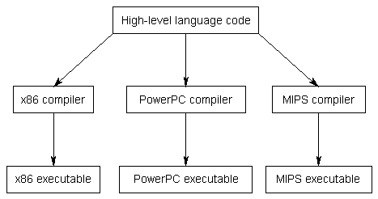

# 0.2 - Introduction to programming languages

Modern computers are incredibly fast, and getting faster all the time. Yet with this speed comes some significant constraints. Computers only natively understand a very limited set of instructions, and must be told exactly what to do. A **program** (also commonly called an **application** or **software**) is a set of instructions that tells the computer what to do. The physical computer machinery that executes the instructions is the **hardware**.

## Machine Language

A computer's CPU is incapable of speaking C++. The very limited set of instructions that a CPU natively understand is called **machine code** (or **machine language** or an **instruction set**). How these instructions are organized is beyond the scope of this introduction, but it is interesting to note two things. First, each instruction is composed of a number of binary digits, each of which can only be a 0 or a 1. These binary numbers are often called bits (short for binary digit). For example, the MIPS architecture instruction set always has instructions that are 32 bits long. Other architectures (such as the x86, which you are likely using) having instructions that can be a variable length.

Here is an example x86 machine language instruction: 10110000 01100001

Second, each set of binary digits is translated by the CPU into an instruction that tells it to do a very specific job, such as compare these two numbers, or put this number in that memory location. Different types of CPUs will typically have different instruction sets, so instructions that would run on a Pentium 4 would not run on a Macintosh PowerPC based computer. Back when computers were first invented, programmers had to write programs directly in machine language, which was a very difficult and time consuming thing to do.

## Assembly Language

Because machine language is so hard to program with, assembly language was invented. In an assembly language, each instruction is identified by a short name (rather than a set of bits), and variables can be identified by names rather than numbers. This makes them much easier to read and write. However, the CPU can not understand assembly language directly. Instead, it must be translated into machine language by using an assembler. Assembly languages tend to be very fast, and assembly is still used today when speed is critical. However, the reason assembly language is so fast is because assembly language is tailored to a particular CPU. Assembly programs written for one CPU will not run on another CPU. Furthermore, assembly languages still require a lot of instructions to do even simple tasks, and are not very human readable.

Here is the same instruction as above in assembly language: mov al, 061h

## High-level Languages

To address these concerns, high-level programming languages were developed. C, C++, Pascal, Java, Javascript, and Perl, are all **high level languages**. High level languages allow the programmer to write programs without having to be as concerned about what kind of computer the program is being run on. Programs written in high level languages must be translated into a form that the CPU can understand before they can be executed. There are two primary ways this is done: compiling and interpreting.

A compiler is a program that reads code and produces a stand-alone executable program that the CPU can understand directly. Once your code has been turned into an executable, you do not need the compiler to run the program. Although it may intuitively seem like high-level languages would be significantly less efficient than assembly languages, modern compilers do an excellent job of converting high-level languages into fast executables. Sometimes, they even do a better job than human coders can do in assembly language!

Here is a simplified representation of the compiling process:

An **interpreter** is a program that directly executes your code without compiling it into machine code first. Interpreters tend to be more flexible, but are less efficient when running programs because the interpreting process needs to be done every time the program is run. This means the interpreter is needed every time the program is run.

Here is a simplified representation of the interpretation process:

Any language can be compiled or interpreted, however, traditionally languages like C, C++, and Pascal are typically compiled, whereas “scripting” languages like Perl and Javascript are interpreted. Some languages, like Java, use a mix of the two.

High level languages have several desirable properties.

First, high level languages are much easier to read and write.

Here is the same instruction as above in C/C++: a = 97;

Second, they require less instructions to perform the same task as lower level languages. In C++ you can do something like a = b * 2 + 5; in one line. In assembly language, this would take 5 or 6 different instructions.

Third, you don’t have to concern yourself with details such as loading variables into CPU registers. The compiler or interpreter takes care of all those details for you.

And fourth, they are portable to different architectures, with one major exception, which we will discuss in a moment.

The exception to portability is that many platforms, such as Microsoft Windows, contain platform-specific functions that you can use in your code. These can make it much easier to write a program for a specific platform, but at the expense of portability. In these tutorials, we will explicitly point out whenever we show you anything that is platform specific.
