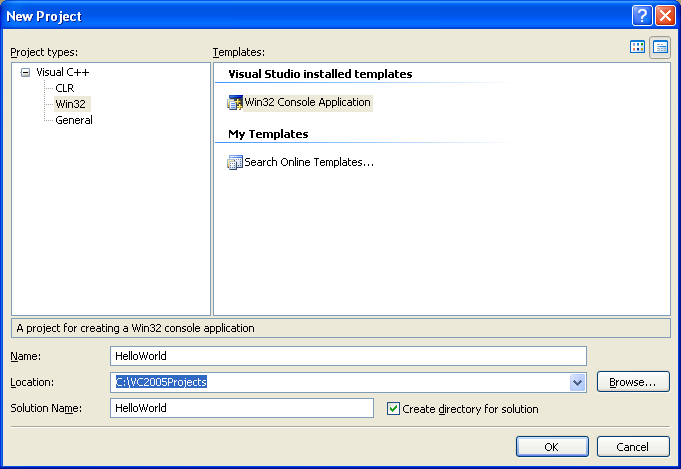
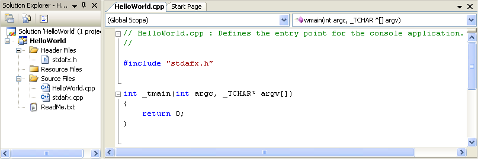
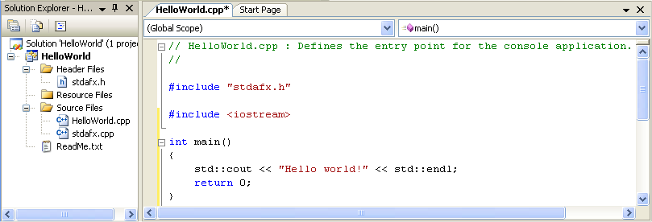
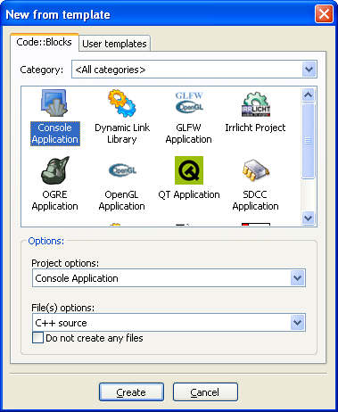
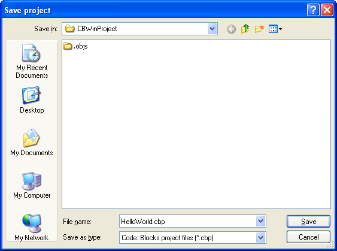
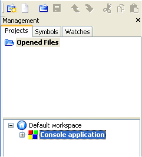
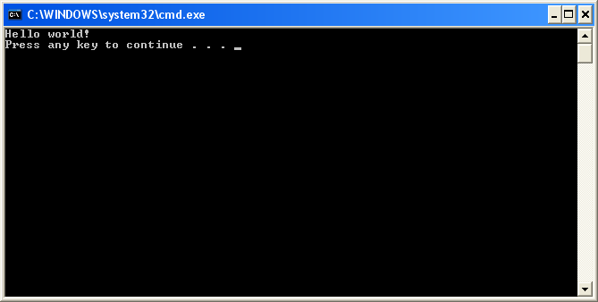

# 0.6 - Compiling your first program

Before we can write our first program (which we will do very soon), we need to know a few things about development environments.

First, although our programs will be written inside .cpp files, the .cpp files themselves will be added to a project. The project stores the names of all the code files we want to compile, and also saves various IDE settings. Every time we reopen the project, it will restore the state of the IDE to where we left off. When we choose to compile our program, the project tells the compiler and linker which files to compile and link. It is worth noting that project files for one IDE will not work in another IDE. You will need to create a new project for each program you write (or overwrite an old one).

Second, there are different kinds of projects. When you create a new project, you will have to pick a project type. All of the projects that we will create in this tutorial will be console projects. A console project means that we are going to create programs that can be run from the dos or linux command-line. By default, console applications have no graphical user interface (GUI) and are compiled into stand-alone executable files. This is perfect for learning C++, because it keeps the complexity to a minimum.

Third, when you create a new project for your program, many IDEs will automatically add your project to a “workspace” or a “solution”. A workspace or solution is a container that can hold one or more related projects. Although you can add multiple projects to a single solution, we recommend creating a new workspace or solution for each program. It’s simpler and there’s less chance of something going wrong.

Traditionally, the first program programmers write in a new language is the infamous hello world program, and we aren’t going to deprive you of that experience! You’ll thank us later. Maybe.

## A quick note about examples containing code

Starting with this lesson, you will see many examples of C++ code presented. Most of these examples will look something like this:

```
#include <iostream>

int main()
{
	std::cout << "Hello world!" << std::endl;
	return 0;
}
```

If you select the code from these examples with your mouse and then copy/paste it into your IDE, you may also get the line numbers (depending on how you made the selection). If so, you’ll need to remove these manually.


## If you’re using the Visual Studio IDE

Although the following section was written using Visual Studio 2005, it essentially works the same for all versions of Visual Studio.

To create a new project in Visual Studio, go to the File menu, and select New -> Project. A dialog box will pop up that looks like this:



First, make sure “Visual C++” is selected on the left side.

Second, underneath “Visual C++”, select the Win32 project type, and Win32 Console Application will automatically be selected for you. In the Name field, you will enter the name of your program. Type in HelloWorld. In the Location field, pick a directory that you would like your project to be placed into. We recommend you place them in a subdirectory off of your C drive, such as C:\VC2005Projects. Click OK, and then Finish.

On the left side, in the Solution Explorer, Visual Studio has created a number of files for you, including stdafx.h, HelloWorld.cpp, and stdafx.cpp.



In the text editor, you will see that VC2005 has already created some code for you. Select and delete all of the code, and type/copy the following into your compiler:

```
#include "stdafx.h"
#include <iostream>

int main()
{
	std::cout << "Hello world!" << std::endl;
	return 0;
}
```

What you end up with should look like this:



To compile your program, either press F7 or go to the Build menu and choose “Build Solution”. If all goes well, you should see the following appear in the Output window:


This means your compile was successful!

To run your compiled program, press ctrl-F5, or go the Debug menu and choose “Start Without Debugging”. You will see the following:


That is the result of your program!

Note: If you see the console window (black box) without any text, your anti-virus may be interfering. Try turning your anti-virus off temporarily and try again.

Important note to Visual Studio users: Visual studio programs should ALWAYS begin with the following line:

```
#include "stdafx.h"
```

Otherwise you will receive a compiler warning, such as c:testtest.cpp(21) : fatal error C1010: unexpected end of file while looking for precompiled header directive

Alternately, you can turn off precompiled headers. However, using precompiled headers will make your program compile much faster, so we recommend leaving them on unless you are developing a cross-platform program.

The example programs we show you throughout the tutorial will not include this line, because it is specific to your compiler.

## If you’re using the Code::Blocks IDE

To create a new project, go to the File menu, and select New Project. A dialog box will pop up that looks like this:



Select Console Application and press the Create button.

You will be asked to save your project. You can save it wherever you wish, though we recommend you save it in a subdirectory off of the C drive, such as C:\CBProjects. Name the project HelloWorld.



You will see “Console Application” under the default workspace:



Open the tree under “Console Application”, open “Sources”, and double click on “main.cpp”. You will see that the hello world program has already been written for you!

To build your project, press ctrl-F9, or go to the Build menu and choose “Build”. If all goes well, you should see the following appear in the Build log window:


This means your compile was successful!

To run your compiled program, press ctrl-F10, or go the Build menu and choose “Run”. You will see something similar to the following:



That is the result of your program!

## If you’re using a command-line based compiler

Paste the following into a text file named HelloWorld.cpp:

```
#include <iostream>

int main()
{
	std::cout << "Hello world!" << std::endl;
	return 0;
}
```

From the command line, type:
```
g++ -o HelloWorld HelloWorld.cpp
```
This will compile and link HelloWorld.cpp. To run it, type:

HelloWorld (or possibly ./HelloWorld), and you will see the output of your program.

##If you’re using a web-based compiler temporarily

Paste the following into the input form:

```
#include <iostream>

int main()
{
	std::cout << "Hello world!" << std::endl;
	return 0;
}
```

and then press “Run”. You should see your output below the form.

Once you install a full IDE, you’ll want to return to this lesson again to learn how to create a project in your IDE.

## If you’re using other IDEs

You will have to figure out how to do the following on your own:
1) Create a console project
2) Add a .cpp file to the project (if necessary)
3) Paste the following code into the file:

```
#include <iostream>

int main()
{
	std::cout << "Hello world!" << std::endl;
	return 0;
}
```

4) Compile the project
5) Run the project

## If compiling fails (aka. “Oh god something went wrong!”)

It’s okay, take a deep breath. We can probably fix it. :)

First, check to ensure that you’ve typed the code in correctly, with no typos or misspellings (also, make sure you’re not including line numbers in your code). The compiler’s error message may give you a clue as to where or what the problem is.

Second, check lesson 0.7 -- A few common C++ problems, as many common problems are addressed there (including the COFF error that many of you are encountering).

If that fails, try searching for your error message on Google. It’s likely someone else has encountered this before and figured out how to fix it.

If you are using a much older C++ compiler, the compiler may give an error about not understanding how to include iostream. If this is the case, try the following program instead:

```
#include <iostream.h>

int main()
{
	cout << "Hello world!" << endl;
	return 0;
}
```

In this case, you should upgrade your compiler to something more compliant with recent standards.

## If your program runs but the window closes immediately

This is an issue with some compilers, such as Bloodshed’s Dev-C++. We present a solution to this problem in section 0.7 -- [A few common C++ problems](http://www.learncpp.com/cpp-tutorial/07-a-few-common-cpp-problems/).

## Conclusion

Congratulations, you made it through the hardest part of this tutorial (installing the IDE and compiling your first program)!

Don’t worry if you don’t understand what all the different lines in the Hello World program do. We’ll look at and explain each line in detail in the upcoming lesson [1.1 -- Structure of a program](http://www.learncpp.com/cpp-tutorial/11-structure-of-a-program/).
