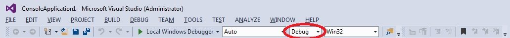
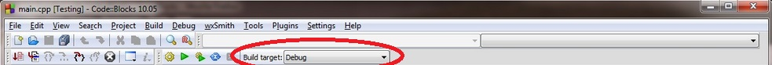

# 0.6a - Build configurations

A build configuration (also called a build target) is a collection of project settings that determines how your IDE will build your project. The build configuration typically includes things like what the executable will be named, what directory the executable will be output in, what directories the IDE will look in for other code and header files, whether to keep or exclude debugging information, and how highly to have the compiler optimize your program. Generally, you will want to leave the settings at their default values unless you have a specific reason to change something.

When you create a new project in your IDE, the IDE will generally set up two different build configurations for you: a release configuration, and a debug configuration.

The debug configuration is designed to help you debug your program, and is generally the one you will use when developing your programs. This configuration turns off all optimizations, and includes debugging information, which makes your programs larger and slower, but much easier to debug. The debug configuration is usually selected as the active configuration by default.

The release configuration is designed to be used when releasing your program to the public. This version is typically optimized for size and performance, and doesn’t contain the extra debugging information.

For example, when the “Hello World” program from the previous lesson was built using Visual Studio 2013, the executable produced in the debug configuration was 65kb, whereas the executable built in the release version was 12kb.

## Switching between debug and release in Visual Studio

There are multiple ways to switch between debug and release in Visual Studio. The easiest way is to find the “Solution Configurations” dropdown in the Standard Toolbar Options menu:

It should be set to Debug or Release. You can change which one you’re using by selecting it in the dropdown.

You can also access the configuration manager dialog, by selecting Build->Configuration Manager, and change the “Active solution configuration”.

## Switching between debug and release in Code::Blocks

In Code::Blocks, you should see a toolbar item called “Build Target”:

It can be set to debug or release in the dropdown.

## Summary

The build configuration holds the settings for different versions of your project. You generally won’t need to touch these settings, but you may want to switch between debug and release.

Rule: Use the debug configuration when developing your programs. When you’re ready to release your executable to others, build it using the release configuration.
Â
