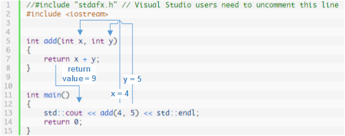

# 1.4a - A first look at function parameters and arguments

## Function parameters and arguments

In the previous lesson, you learned that a function can return a value back to the caller via the function's return value.

In many cases, it is useful to be able to pass information to a function being called, so that the function has data to work with. For example, if we wanted to write a function to add two numbers, we need a way to tell the function which two numbers to add when we call it. Otherwise, how would the function know what to add? We do that via function parameters and arguments.

A function **parameter** is a variable used in a function where the value is provided by the caller of the function. Function parameters are placed in between the parenthesis after the function identifier, with multiple parameters being separated by commas.

Here’s some examples of functions with different numbers of parameters:

```
// This function takes no parameters
// It does not rely on the caller for anything
void doPrint()
{
    std::cout << "In doPrint()" << std::endl;
}

// This function takes one integer parameter named x
// The caller will supply the value of x
void printValue(int x)
{
    std::cout << x  << std::endl;
}

// This function has two integer parameters, one named x, and one named y
// The caller will supply the value of both x and y
int add(int x, int y)
{
    return x + y;
}
```

An **argument** is a value that is passed from the caller to the function when a function call is made:

```
printValue(6); // 6 is the argument passed to function printValue()
add(2, 3); // 2 and 3 are the arguments passed to function add()
```

Note that multiple arguments are also separated by commas. The number of arguments must match the number of function parameters. Otherwise, the compiler will throw an error.

## How parameters and arguments work together

When a function is called, all of the parameters of the function are created as variables, and the value of each of the arguments is copied into the matching parameter. This process is called **pass by value**.

For example:

```
//#include "stdafx.h" // Visual Studio users need to uncomment this line
#include <iostream>

// This function has two integer parameters, one named x, and one named y
// The values of x and y are passed in by the caller
void printValues(int x, int y)
{
    std::cout << x << std::endl;
    std::cout << y << std::endl;
}

int main()
{
    printValues(6, 7); // This function call has two arguments, 6 and 7

    return 0;
}
```

When printValues() is called with arguments 6 and 7, printValues’s parameter x is created and assigned the value of 6, and printValues’s parameter y is created and assigned the value of 7.

This result in the output:

```
6
7
```

## How parameters and return values work together

By using both parameters and a return value, we can create functions that take data as input, do some calculation with it, and return the value to the caller.

Here is an example of a very simple function that adds two numbers together and returns the result to the caller.

```
//#include "stdafx.h" // Visual Studio users need to uncomment this line
#include <iostream>

// add() takes two integers as parameters, and returns the result of their sum
// The values of x and y are determined by the function that calls add()
int add(int x, int y)
{
    return x + y;
}

// main takes no parameters
int main()
{
    std::cout << add(4, 5) << std::endl; // Arguments 4 and 5 are passed to function add()
    return 0;
}
```

When function add() is called, parameter x is assigned the value 4, and parameter y is assigned the value 5.

The function add() then evaluates x + y, which is the value 9, and returns this value back to function main(). This value of 9 is then sent to cout (by main()) to be printed on the screen.

Output:

```
9
```

In pictorial format:




## More examples

Let’s take a look at some more function calls:

```
//#include "stdafx.h" // Visual Studio users need to uncomment this line
#include <iostream>

int add(int x, int y)
{
    return x + y;
}

int multiply(int z, int w)
{
    return z * w;
}

int main()
{
    using namespace std;
    cout << add(4, 5) << endl; // within add(), x=4, y=5, so x+y=9
    cout << multiply(2, 3) << endl; // within multiply(), z=2, w=3, so z*w=6

    // We can pass the value of expressions
    cout << add(1 + 2, 3 * 4) << endl; // within add(), x=3, y=12, so x+y=15

    // We can pass the value of variables
    int a = 5;
    cout << add(a, a) << endl; // evaluates (5 + 5)

    cout << add(1, multiply(2, 3)) << endl; // evaluates 1 + (2 * 3)
    cout << add(1, add(2, 3)) << endl; // evaluates 1 + (2 + 3)

    return 0;
}
```

This program produces the output:

```
9
6
15
10
7
6
```

The first two statements are straightforward.

In the third statement, the parameters are expressions that get evaluated before being passed. In this case, 1 + 2 evaluates to 3, so 3 is passed to x. 3 * 4 evaluates to 12, so 12 is passed to y. add(3, 12) resolves to 15.

The next pair of statements is relatively easy as well:

```
int a = 5;
cout << add(a, a) << endl; // evaluates (5 + 5)
```

In this case, add() is called where x = a and y = a. Since a = 5, add(a, a) = add(5, 5), which resolves to 10.

Let’s take a look at the first tricky statement in the bunch:

```
cout << add(1, multiply(2, 3)) << endl; // evaluates 1 + (2 * 3)
```

When the function add() is executed, the CPU needs to determine what the values for parameters x and y are. x is simple since we just passed it the integer 1, so it assigns x=1. To get a value for y, it needs to evaluate multiply(2, 3) first. The CPU assigns z = 2 and w = 3, and multiply(2, 3) returns the integer value 6. That return value of 6 can now be assigned to the y parameter of the add() function. add(1, 6) returns the integer 7, which is then passed to cout for printing.

Put less verbosely (where the => symbol is used to represent evaluation):
add(1, multiply(2, 3)) => add(1, 6) => 7

The following statement looks tricky because one of the parameters given to add() is another call to add().

```
cout << add(1, add(2, 3)) << endl; // evaluates 1 + (2 + 3)
```

But this case works exactly the same as the above case where one of the parameters is a call to multiply().

Before the CPU can evaluate the outer call to add(), it must evaluate the inner call to add(2, 3). add(2, 3) evaluates to 5. Now it can evaluate add(1, 5), which evaluates to the value 6. cout is passed the value 6.

Less verbosely:
add(1, add(2, 3)) => add(1, 5) => 6

## Conclusion

Parameters are the key mechanism by which functions can be written in a reusable way, as it allows them to perform tasks without knowing the specific input values ahead of time. Those input values are passed in as arguments by the caller.

Return values allow a function to return a value back to the caller.


## Quiz

1) What’s wrong with this program fragment?

```
void multiply(int x, int y)
{
    return x * y;
}

int main()
{
    std::cout << multiply(4, 5) << std::endl;
    return 0;
}
```

2) What two things are wrong with this program fragment?

```
int multiply(int x, int y)
{
    int product = x * y;
}

int main()
{
    std::cout << multiply(4) << std::endl;
    return 0;
}
```

3) What value does the following program print?

```
#include <iostream>

int add(int x, int y, int z)
{
    return x + y + z;
}

int multiply(int x, int y)
{
    return x * y;
}

int main()
{
    std::cout << multiply(add(1, 2, 3), 4) << std::endl;
    return 0;
}
```

4) Write a function called doubleNumber() that takes one integer parameter and returns twice the value passed in.

5) Write a complete program that reads an integer from the user (using cin, discussed in lesson 1.3a -- A first look at cout, cin, endl, namespaces, and using statements), doubles it using the doubleNumber() function you wrote for question 4, and then prints the doubled value out to the console.
