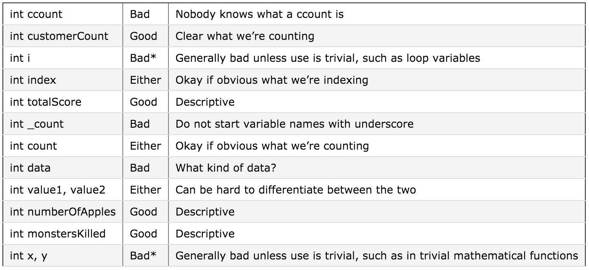

# 1.4d - Keywords and naming identifiers

## Keywords

C++ reserves a set of 73 words for its own use. These words are called **keyword**, and each of these keywords has a special meaning within the C++ language.

Here is a list of all the C++ keywords (through C++11):


\* These 15 keywords were added in C++98. Some older reference books or material may omit these.

\*\* These 9 keywords were added in C++11. If your compiler is not C++11 compliant, these keywords may not be functional.

You have already run across some of these keywords, including int, void, return, using, and namespace. Along with a set of operators, these keywords define the entire language of C++ (preprocessor commands excluded). Because these keywords have special meaning, your IDEs will change the text color of these words (usually to blue) to make them more visible.

By the time you are done with this tutorial, you will understand what almost all of these words do!

## Identifiers, and naming them

The name of a variable, function, class, or other object in C++ is called an identifier. C++ gives you a lot of flexibility to name identifiers as you wish. However, there are a few rules that must be followed when naming identifiers:

- The identifier can not be a keyword. Keywords are reserved.
- The identifier can only be composed of letters (lower or upper case), numbers, and the underscore character. That means the name can not contain symbols (except the underscore) nor whitespace.
- The identifier must begin with a letter (lower or upper case) or an underscore. It can not start with a number.
- C++ distinguishes between lower and upper case letters. nvalue is different than nValue is different than NVALUE.

Now that you know how you can name a variable, let’s talk about how you should name a variable or function.

First, it is a convention in C++ that variable names should begin with a lowercase letter. If the variable name is one word, the whole thing should be written in lowercase letters.

```
int value; // correct

int Value; // incorrect (should start with lower case letter)
int VALUE; // incorrect (should start with lower case letter)
int VaLuE; // incorrect (see your psychiatrist) ;)
```

Generally, functions are also started with a lowercase letter (though there’s some disagreement on this point). We’ll start ours with lower case letters because main() (which all programs must have) starts with a lower case letter, as do all of the functions in the standard template library.

Identifier names that start with a capital letter are typically used for structs, classes, and enumerations (all of which we will cover later).

If the variable or function name is multi-word, there are two common conventions: separated by underscores, or intercapped (sometimes called CamelCase).

```
int my_variable_name; // correct (separated by underscores)
int myVariableName; // correct (intercapped/camelCase)

int my variable name; // incorrect (spaces not allowed)
int MyVariableName; // incorrect (should start with lower case letter)
```

In this tutorial, we will typically use the intercapped approach because it’s easier to read (it’s easy to mistake an underscore for a space in dense blocks of code). But it’s common to see either -- the C++ standard library uses the underscore method for both variables and functions. Sometimes you’ll see a mix of the two: underscores used for variables and intercaps used for functions.

Second, you should avoid naming your identifiers starting with an underscore, as these names are typically reserved for OS, library, and/or compiler use.

Third, and this is perhaps the most important rule of all, give your identifiers names that actually describe what they are. It is typical for inexperienced programmers to make variable names as short as possible, either to save on typing or because they figure the meaning is obvious. This is almost always a mistake. Ideally, variables should be named in a way that would help someone who has no idea what your code does be able to figure it out as quickly as possible. In 3 months, when you look at your program again, you’ll have forgotten how it works, and you’ll thank yourself for picking variable names that make sense. The more complex the code the variable is being used in, the better name it should have.



\* Note: it is okay to use trivial variable names for variables that have a trivial use, such as loop variables, or trivial mathematical functions.

Fourth, a clarifying comment can go a long way. For example, say we’ve declared a variable named numberOfChars that is supposed to store the number of characters in a piece of text. Does the text “Hello World!” have 10, 11, or 12 characters? It depends on whether we’re including whitespace or punctuation. Rather than naming the variable numberOfCharsIncludingWhitespaceAndPunctuation, which is rather lengthy, a well placed comment on the declaration line should help the user figure it out:

```
// holds number of chars in a piece of text -- including whitespace and punctuation!
int numberOfChars;
```


## Quiz

Pick which variables are improperly named according to standard conventions (i.e. how you should name a variable) and indicate why.

1) int sum;
2) int _apples;
3) int VALUE;
4) int my variable name;
5) int TotalCustomers;
6) int void;
7) int numFruit;
8) int 3some;
9) int meters_of_pipe;
