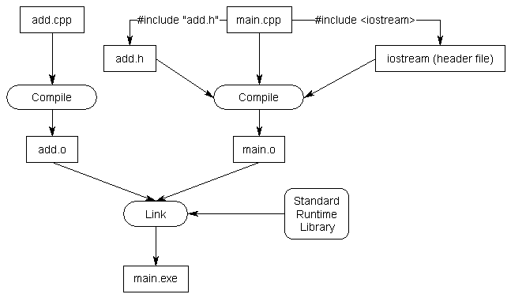

# 1.9 - Header files

## Headers, and their purpose

As programs grow larger and larger (and include more files), it becomes increasingly tedious to have to forward declare every function you want to use that lives in a different file. Wouldn’t it be nice if you could put all your declarations in one place?

C++ code files (with a .cpp extension) are not the only files commonly seen in C++ programs. The other type of file is called a **header file**, sometimes known as an **include file**. Header files usually have a .h extension, but you will sometimes see them with a .hpp extension or no extension at all. The purpose of a header file is to hold declarations for other files to use.

## Using standard library header files

Consider the following program:

```
#include <iostream>
int main()
{
    using namespace std;
    cout << "Hello, world!" << endl;
    return 0;
}
```

This program prints “Hello, world!” to the console using cout. However, this program never defines cout, so how does the compiler know what cout is? The answer is that cout has been declared in a header file called “iostream”. When we use the line #include <iostream>, we’re requesting that all of the content from the header file named “iostream” be copied into the including file. That makes the content from the header file available for use in our code file.

Keep in mind that header files typically only contain declarations. They do not define how something is implemented. So if cout is only declared in the “iostream” header file, where is it actually defined? It is implemented in the C++ runtime support library, which is automatically linked into your program during the link phase.


Consider what would happen if the iostream header did not exist. Whenever you used std::cout, you would have to manually copy in all of the declarations related to std::cout into the top of each file that used it! This would require knowledge of what's relevant and what's not. It's much easier to just ```#include iostream``` !


## Writing your own header files

Now let's go back to the example we were discussing in the previous lesson. When we left off, we had two files, add.cpp and main.cpp, that looked like this:

add.cpp

```
int add(int x, int y)
{
    return x + y;
}
```

main.cpp

```
#include <iostream>

int add(int x, int y); // forward declaration using function prototype

int main()
{
    using namespace std;
    cout << "The sum of 3 and 4 is " << add(3, 4) << endl;
    return 0;
}
```

(If you’re recreating this example from scratch, don’t forget to add add.cpp to your project so it gets compiled in).

We’d used a forward declaration so that the compiler would know what add was when compiling main.cpp. As previously mentioned, writing forward declarations for every function you want to use that lives in another file can get tedious quickly.

Header files can relieve us of this burden. A header file only has to be written once, and it can be included in as many files as needed. This also helps with maintenance by minimizing the number of changes that need to be made if a function prototype ever changes (eg. by adding a new parameter).

Writing our own header files is surprisingly easy. Header files consist of two parts.

The first part is called a **header guard**, which is discussed in the next lesson (on the preprocessor). Header guards prevent a given header file from being #included more than once from the same file.

The second part is the actual content of the .h file, which should be the declarations for all of the functions we want other files to be able to see. Our header files should all have a .h extension, so we’ll call our new header file add.h:

add.h:

```
// This is start of the header guard.  ADD_H can be any unique name.  By convention, we use the name of the header file.
#ifndef ADD_H
#define ADD_H

// This is the content of the .h file, which is where the declarations go
int add(int x, int y); // function prototype for add.h -- don't forget the semicolon!

// This is the end of the header guard
#endif
```

In order to use this header file in main.cpp, we have to include it.

main.cpp that includes add.h:

```
#include <iostream>
#include "add.h"

int main()
{
    using namespace std;
    cout << "The sum of 3 and 4 is " << add(3, 4) << endl;
    return 0;
}
```

add.cpp stays the same:

```
int add(int x, int y)
{
    return x + y;
}
```


When the compiler compiles the #include "add.h" line, it copies the contents of add.h into the current file at that point. Because our add.h contains a function prototype for add(), this prototype is now being used as a forward declaration of add()!

Consequently, our program will compile and link correctly.

Note: When you #include a file, the entire content of the included file is inserted at the point of inclusion.



If you get a compiler error about add.h not being found, make sure the file is really named add.h. Depending on how you created and named it, it’s possible the file could have been named something like “add” (no extension) or “add.h.txt” or “add.hpp”.

If you get a linker error about add() not being defined, make sure you’ve included add.cpp in your project so it compiles properly!

## Angled brackets vs quotes

You’re probably curious why we use angled brackets for iostream, and double quotes for add.h. The answer is that angled brackets are used to tell the compiler that we are including a header file that was included with the compiler, so it should look for that header file in the system directories. The double-quotes tell the compiler that this is a header file we are supplying, so it should look for that header file in the current directory containing our source code first. If it doesn’t find the header file there, it will check any other include paths that you’ve specified as part of your compiler/IDE settings. That failing, it will fall back to checking the system directories.

Rule: Use angled brackets to include header files that come with the compiler. Use double quotes to include any other header files.

## Why doesn't iostream have a .h extensive ?

Another commonly asked question is “why doesn’t iostream (or any of the other standard library header files) have a .h extension?”. The answer is, because iostream.h is a different header file than iostream is! To explain requires a very short history lesson.

When C++ was first created, all of the files in the standard runtime library ended in .h. Life was consistent, and it was good. The original version of cout and cin lived in iostream.h. When the language was standardized by the ANSI committee, they decided to move all of the functions in the runtime library into the std namespace (which is generally a good idea). However, this presented a problem: if they moved all the functions into the std namespace, none of the old programs would work any more!

To try to get around this issue and provide backwards compatibility for older programs, a new set of header files was introduced that use the same names but lack the .h extension. These new header files have all their functionality inside the std namespace. This way, older programs that include #include <iostream.h> do not need to be rewritten, and newer programs can #include <iostream>.

When you include a header file from the standard library, make sure you use the non .h version if it exists. Otherwise you will be using a deprecated version of the header that is no longer supported.

As a side note, many headers in the standard library do not have a non .h version, only a .h version. For these files, it is fine to include the .h version. Many of these libraries are backwards compatible with standard C programming, and C does not support namespaces. Consequently, the functionality of these libraries will not be accessed through the std namespace. Also, when you write your own header files, you should give them all a .h extension, since you will not be putting your code in the std namespace.

Rule: use the non .h version of a library if it exists, and access the functionality through the std namespace. If the non .h version does not exist, or you are creating your own headers, use the .h version


## Including header files from other directories

Another common question involves how to include header files from other directories.

One (bad) way to do this is to include a relative path to the header file you want to include as part of the #include line. For example:

```
#include "headers/myHeader.h"
#include "../moreHeaders/myOtherHeader.h"
```

The downside of this approach is that it requires you to reflect your directory structure in your code. If you ever update your directory structure, your code won't work any more.

A better method is to tell your compiler or IDE that you have a bunch of header files in some other location, so that it will look there when it can’t find them in the current directory. This can generally be done by setting an “include path” or “search directory” in your IDE project settings.

In Visual Studio, you can right click on your project in the Solution Explorer, and choose “Properties”, then the “VC++ Directories” tab. From here, you will see a line called “Include Directories”. Add your include directories there.

In Code::Blocks, go to the Project menu and select “Build Options”, then the “Search directories” tab. Add your include directories there.

Using g++, you can use the -I option to specify an alternate include directory.

```
g++ -o main -I /source/includes main.cpp
```

The nice thing about this approach is that if you ever change your directory structure, you only have to change a single compiler or IDE setting instead of every code file.

## Can I put function definitions in a header file?

C++ won’t complain if you do, but generally speaking, you shouldn’t.

As noted above, when you #include a file, the entire content of the included file is inserted at the point of inclusion. This means that any definitions you put in your header get copied into every file that includes that header.

For small projects, this isn’t likely to be much of an issue. But for larger projects, this can make things take much longer to compile (as the same code gets recompiled each time it is encountered) and could significantly bloat the size of your executable. If you make a change to a definition in a code file, only that .cpp file needs to be recompiled. If you make a change to a definition in a header file, every code file that includes the header needs to be recompiled. One small change can cause you to have to recompile your entire project!

Sometimes exceptions are made for trivial functions that are unlikely to change (e.g. where the function definition is one line).


## Header file best practices

Here are a few best practices for creating your own header files.

- Always include header guards.
- Do not define variables in header files unless they are constants. Header files should generally only be used for declarations.
- Do not define functions in header files.
- Each header file should have a specific job, and be as independent as possible. For example, you might put all your declarations related to functionality A in A.h and all your declarations related to functionality B in B.h. That way if you only care about A later, you can just include A.h and not get any of the stuff related to B.
- Give your header files the same name as the source files they’re associated with (e.g. grades.h goes with grades.cpp).
- Try to minimize the number of other header files you #include in your header files. Only #include what is necessary.
- Do not #include .cpp files.
