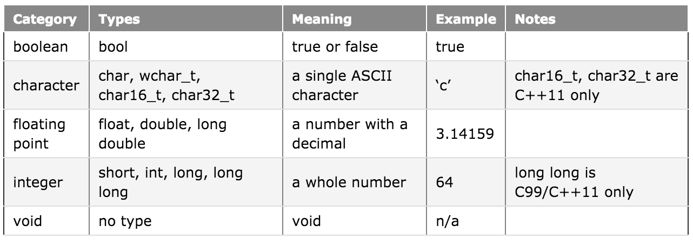

# 2.1 - Fundamental variable definition, initialization, and assignment

## Addressing memory

This lesson builds directly on the material in the section “1.3 -- A first look at variables“.

In the previous lesson on variables, we talked about the fact that variables are names for a piece of memory that can be used to store information. To recap briefly, computers have random access memory (RAM) that is available for programs to use. When a variable is defined, a piece of that memory is set aside for that variable.

The smallest unit of memory is a binary digit (bit), which can hold a value of 0 or 1. You can think of a bit as being like a traditional light switch -- either the light is off (0), or it is on (1). There is no in-between. If you were to look at a random segment of memory, all you would see is …011010100101010… or some combination thereof. Memory is organized into sequential units called addresses. Similar to how a street address can be used to find a given house on a street, the memory address allows us to find and access the contents of memory at a particular location. Perhaps surprisingly, in modern computers, each bit does not get its own address. The smallest addressable unit of memory is a group of 8 bits known as a byte.

The following picture shows some sequential memory addresses, along with the corresponding byte of data:


Because all data on a computer is just a sequence of bits, we use a data type to tell us how to interpret the contents of memory in some meaningful way. You have already seen one example of a data type: the integer. When we declare a variable as an integer, we are telling the compiler “the piece of memory that this variable addresses is going to be interpreted as a whole number”.

When you assign a value to a data type, the compiler and CPU take care of the details of encoding your value into the appropriate sequence of bits for that data type. When you ask for your value back, your number is “reconstituted” from the sequence of bits in memory.

There are many other data types in C++ besides the integer, most of which we will cover shortly. As shorthand, we typically refer to a variable’s “data type” as its “type”.

## Fundamental data types

C++ comes with built-in support for certain data types. These are called fundamental data types (in the C++ specification), but are often informally called basic types, primitive types, or built-in types.

Here is a list of the fundamental data types, some of which you have already seen:



This chapter is dedicated to exploring these basic data types in detail.


## Defining a variable

In the “basic C++” section, you already learned how to define an integer variable:

```
int nVarName; // int is the type, nVarName is the name of the variable
```

To define variables of other data types, the idea is exactly the same:

```
type varName; // type is the type (eg. int), varName is the name of the variable
```

In the following example, we define 5 different variables of 5 different types.

```
bool bValue;
char chValue;
int nValue;
float fValue;
double dValue;
```

## Variable initialization

When a variable is defined, you can immediately give that variable a value. This is called initialization.

When we assign values to a defined variable using the assignment operator (equals sign), it’s called an explicit initialization:

```
int nValue = 5; // explicit initialization
```

When a variable is defined, you can also assign a value using an implicit initialization:

```
int nValue(5); // implicit initialization
```

Even though implicit initialization looks a lot like a function call, the compiler keeps track of which names are variables and which are functions so that they can be resolved properly.

Implicit initialization can perform better than explicit initialization for some data types, and comes with some other benefits once we start talking about classes. It also helps differentiate initialization from assignment. Consequently, we recommend its use over explicit initialization.

Rule: Favor implicit initialization over explicit initialization

## Uniform initialization in C++11

Because C++ grew organically, the explicit and implicit initialization forms only work for some types of variables (for example, you can’t use either of these forms to initialize a list of values).

In an attempt to provide a single initialization mechanism that will work with all data types, C++11 adds a new form of initialization called uniform initialization:

```
int value{5};
```

Initializing a variable with an empty brace indicates default initialization. Default initialization initializes the variable to zero (or empty, if that’s more appropriate for a given type).

```
int value{}; // default initialization to 0
```

Uniform initialization has the added benefit of disallowing “narrowing” type conversions. This means that if you try to use uniform initialization to initialize a variable with a value it can not safely hold, the compiler will throw an warning or error. For example:

```
int value{4.5}; // error: an integer variable can not hold a non-integer value
```

Uniform initialization is sometimes called list initialization, though we prefer the term “uniform initialization” because neither the initializer nor the variable need to be a list.

Rule: If you’re using a C++11 compatible compiler, favor uniform initialization

## Variable assignment

When a variable is given a value after it has been defined, it is called an assignment.

```
int nValue;
nValue = 5; // explicit assignment
```

C++ does not provide any built-in way to do an implicit assignment.


## Defining multiple variables

It is possible to define multiple variables of the same type in a single statement by separating the names with a comma. The following 2 snippets of code are effectively the same:

```
int a, b;

int a;
int b;
```

You can also initialize multiple variables defined on the same line:

```
int a = 5, b = 6;
int c(7), d(8);
int e{9}, f{10}
```

There are three mistakes that new programmers tend to make when defining multiple variables in the same statement.

The first mistake is giving each variable a type when defining variables in sequence. This is not a bad mistake because the compiler will complain and ask you to fix it.

```
int a, int b; // wrong (compiler error)

int a, b; // correct
```

The second error is to try to define variables of different types on the same line, which is not allowed. Variables of different types must be defined in separate statements. This is also not a bad mistake because the compiler will complain and ask you to fix it.

```
int a, double b; // wrong (compiler error)

int a; double b; // correct (but not recommended)

// correct and recommended (easier to read)
int a;
double b;
```

The last mistake is the dangerous case. In this case, the programmer mistakenly tries to initialize both variables by using one assignment statement:

```
int a, b = 5; // wrong (a is uninitialized!)

int a= 5, b= 5; // correct
```

In the top statement, variable “a” will be left uninitialized, and the compiler may or may not complain. If it doesn’t, this is a great way to have your program intermittently crash and produce sporadic results.

The best way to remember that this is wrong is to consider the case of implicit initialization or brace-initialization:

```
int a, b(5);
int c, d{5};
```

This makes it seem a little more clear that the value 5 is only being assigned to variable b.

Because defining multiple variables on a single line AND initializing them is a recipe for mistakes, we recommend that you only define multiple variables on a line if you’re not initializing any of them.

Rule: Avoid defining multiple variables on a single line if initializing any of them.

## Write to define variables

Older C compilers forced users to define all of the variables in a function at the top of the function:

```
int main()
{
    // all variable up top
    int x;
    int y;

    // then code
    using namespace std;
    cout << "Enter a number: ";
    cin >> x;

    cout << "Enter another number: ";
    cin >> y;

    cout << "The sum is: " << x + y << endl;
    return 0;
}
```

This style is now obsolete. C++ compilers do not require all variables to be defined at the top of a function. The proper C++ style is to define variables as close to the first use of that variable as possible:

```
int main()
{
    using namespace std;

    cout << "Enter a number: ";
    int x; // we need x on the next line, so we'll declare it here, as close to its first use as possible.
    cin >> x; // first use of x

    cout << "Enter another number: ";
    int y; // we don't need y until now, so it gets declared here
    cin >> y; // first use of y

    cout << "The sum is: " << x + y << endl;
    return 0;
}
```

This has quite a few advantages.

First, variables that are defined only when needed are given context by the statements around them. If x were defined at the top of the function, we would have no idea what it was used for until we scanned the function and found where it was used. Defining x amongst a bunch of input/output statements helps make it obvious that this variable is being used for input and/or output.

Second, defining a variable only where it is needed tells us that this variable does not affect anything above it, making our program easier to understand and requiring less scrolling.

Finally, it reduces the likelihood of inadvertently leaving a variable uninitialized, because we can define and then immediately initialize it with the value we want it to have.

Rule: Define variables as close to their first use as possible.
